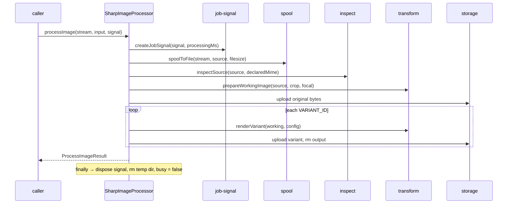

```mermaid
sequenceDiagram
  participant C as caller
  participant P as SharpImageProcessor
  participant J as job-signal
  participant S as spool
  participant I as inspect
  participant T as transform
  participant R as storage
  C->>P: processImage(stream, input, signal)
  P->>J: createJobSignal(signal, processingMs)
  P->>S: spoolToFile(stream, source, filesize)
  P->>I: inspectSource(source, declaredMime)
  P->>T: prepareWorkingImage(source, crop, focal)
  P->>R: upload original bytes
  loop each VARIANT_ID
    P->>T: renderVariant(working, config)
    P->>R: upload variant, rm output
  end
  P-->>C: ProcessImageResult
  Note over P: finally → dispose signal, rm temp dir, busy = false
```
