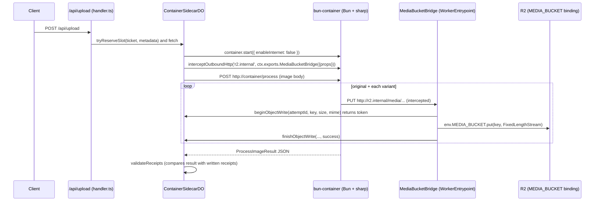

```mermaid
 sequenceDiagram
        participant C as Client
        participant U as /api/upload (handler.ts)
        participant DO as ContainerSidecarDO
        participant BC as bun-container (Bun + sharp)
        participant B as MediaBucketBridge (WorkerEntrypoint)
        participant R2 as R2 (MEDIA_BUCKET binding)

        C->>U: POST /api/upload
        U->>DO: tryReserveSlot(ticket, metadata) and fetch
        DO->>BC: container.start({ enableInternet: false })
        DO->>BC: interceptOutboundHttp('r2.internal', ctx.exports.MediaBucketBridge({props}))
        DO->>BC: POST http://container/process (image body)
        loop original + each variant
            BC->>B: PUT http://r2.internal/media/... (intercepted)
            B->>DO: beginObjectWrite(attemptId, key, size, mime) returns token
            B->>R2: env.MEDIA_BUCKET.put(key, FixedLengthStream)
            B->>DO: finishObjectWrite(..., success)
        end
        BC-->>DO: ProcessImageResult JSON
        DO->>DO: validateReceipts (compares result with written receipts)
```