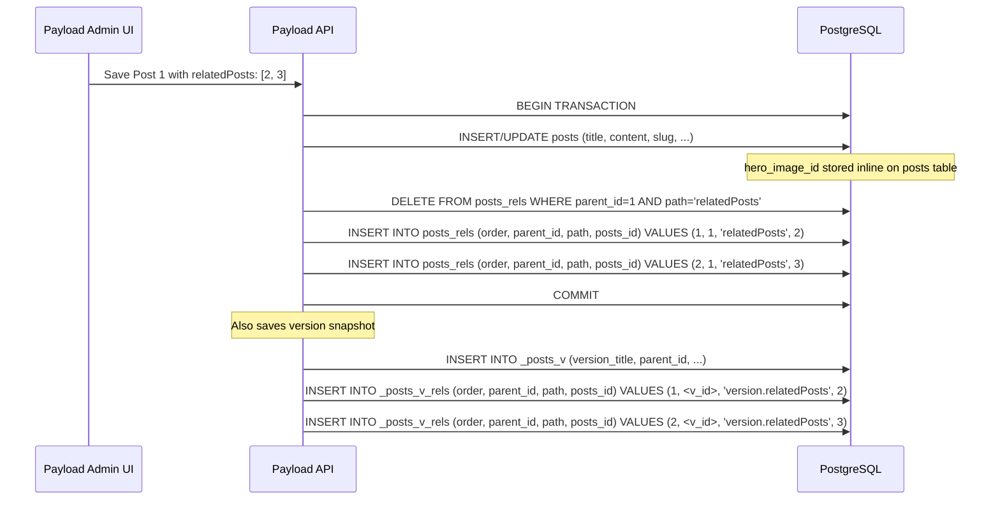

# **How the Save Flow Works**

## 1. Đơn giản hóa logic cập nhật (Simplifies Update Logic)

Khi một người quản trị chỉnh sửa bài viết trên giao diện, client sẽ gửi lên server một mảng các ID mới cho một trường quan hệ (ví dụ: trường relatedPosts gửi lên [2, 3]). Nếu không dùng chiến lược xóa-rồi-chèn, Payload sẽ phải thực hiện các bước:

SELECT các quan hệ hiện có từ database.
Thực hiện thuật toán so sánh (Diff) giữa mảng cũ và mảng mới để tìm ra:
Những ID mới cần INSERT.
Những ID không còn tồn tại cần DELETE.
Những ID giữ nguyên nhưng bị thay đổi vị trí cần UPDATE. Thuật toán Diff này phức tạp, cồng kềnh và dễ sinh ra lỗi (bug). Thay vào đó, thao tác DELETE FROM posts_rels WHERE parent_id = X AND path = Y theo sau là INSERT các bản ghi mới giúp logic backend cực kỳ đơn giản, sạch sẽ và đáng tin cậy.

## 2. Quản lý thứ tự (Ordering) một cách hoàn hảo

Bạn có thể thấy trong bảng posts_rels có cột order. Đối với Payload, thứ tự sắp xếp của các quan hệ là rất quan trọng (ví dụ: tác giả nào đứng trước, bài viết liên quan nào hiển thị trước). Nếu một người dùng chỉ đơn giản là đổi chỗ 2 bài viết liên quan cho nhau trong danh sách, việc viết câu lệnh UPDATE để tráo đổi giá trị order của các dòng hiện tại là rất phiền phức và dễ dẫn đến xung đột (conflict constraint). Với "Delete-then-reinsert", Payload chỉ cần lặp qua mảng gửi lên, gán order = index + 1 và insert. Thứ tự luôn được phản ánh chính xác 100% như những gì user nhìn thấy trên UI.
