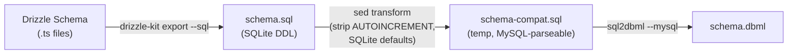

# Export Drizzle Schema to SQL + DBML

## Goal
Export all Drizzle ORM SQLite schema definitions to both `.sql` and `.dbml` files inside `src/server/db/dbml/`. The old `dbml/` folder at the project root is kept untouched.

## Background

| Item | Current State |
|------|-------------|
| Schema files | 7 modules in [`src/server/db/schema/`](file:///home/tien/Documents/code/texcra/src/server/db/schema/index.ts) — 20 tables total |
| Dialect | SQLite (Cloudflare D1) |
| Existing `dbml/` | Project-root [`dbml/`](file:///home/tien/Documents/code/texcra/dbml/) — old PostgreSQL-dialect SQL/DBML — **kept as-is** |
| `drizzle-kit export` | Built-in, outputs clean SQLite DDL to stdout |
| `sql2dbml` | Available via `@dbml/cli` (devDep) — needs `--mysql` flag for backtick-quoted identifiers |

### Pipeline



### `sql2dbml` compatibility

`sql2dbml` has no `--sqlite` flag. My testing confirmed the `--mysql` parser works after two `sed` transforms on the SQLite DDL:

| SQLite syntax | Transform | Reason |
|--------------|-----------|--------|
| `AUTOINCREMENT` | Strip | Not valid MySQL; `sql2dbml` chokes on it |
| `DEFAULT (unixepoch() * 1000)` | Replace with `DEFAULT 0` | SQLite function expression; not parseable by MySQL grammar |

Both the original `schema.sql` (pure SQLite) **and** the DBML output are written to `src/server/db/dbml/`. The temp compat file is discarded.

## Proposed Changes

### New directory: `src/server/db/dbml/`

This is a new folder that will contain the generated artifacts:

```
src/server/db/dbml/
├── schema.sql    ← full SQLite DDL (drizzle-kit export)
└── schema.dbml   ← DBML diagram (sql2dbml from the SQL)
```

---

### [NEW] `scripts/export-schema.sh`

Shell script that runs the full pipeline:

```bash
#!/usr/bin/env bash
# Export Drizzle schema to SQL and DBML files
# Output: src/server/db/dbml/schema.sql + schema.dbml
set -euo pipefail

SCRIPT_DIR="$(cd "$(dirname "${BASH_SOURCE[0]}")" && pwd)"
PROJECT_ROOT="$(cd "$SCRIPT_DIR/.." && pwd)"
OUTPUT_DIR="$PROJECT_ROOT/src/server/db/dbml"

mkdir -p "$OUTPUT_DIR"

echo "→ Exporting Drizzle schema to SQL..."
pnpm exec drizzle-kit export --sql 2>/dev/null \
  | grep -v '^Already up to date' \
  | grep -v '^Done in' \
  > "$OUTPUT_DIR/schema.sql"

echo "→ Converting SQL to DBML..."
# sql2dbml has no --sqlite flag; use --mysql (backtick compat) after
# stripping SQLite-specific syntax that the MySQL parser can't handle
TEMP_FILE=$(mktemp)
sed \
  -e 's/ AUTOINCREMENT//g' \
  -e "s/DEFAULT (unixepoch() \* 1000)/DEFAULT 0/g" \
  "$OUTPUT_DIR/schema.sql" > "$TEMP_FILE"

pnpm exec sql2dbml --mysql "$TEMP_FILE" \
  -o "$OUTPUT_DIR/schema.dbml" 2>/dev/null

rm -f "$TEMP_FILE"

echo "✓ Exported to:"
echo "  SQL:  $OUTPUT_DIR/schema.sql"
echo "  DBML: $OUTPUT_DIR/schema.dbml"
```

---

### [MODIFY] `package.json`

Add one new script:

```diff
  "scripts": {
    "dev": "vite dev --port 3000",
    "generate-routes": "tsr generate",
    "build": "vite build",
    "preview": "vite preview",
    "lint": "eslint",
    "format": "prettier --write . && eslint --fix",
    "check": "prettier --check .",
    "typecheck": "tsc --noEmit",
    "db:generate": "drizzle-kit generate",
+   "db:export": "bash scripts/export-schema.sh",
    "test:db": "tsx scripts/verify-db.ts",
```

Usage: `pnpm run db:export`

---

### Summary of what stays / changes

| Path | Action |
|------|--------|
| `dbml/` (project root) | **No change** — old PostgreSQL DBML/SQL kept as-is |
| `src/server/db/dbml/schema.sql` | **NEW** — generated SQLite DDL |
| `src/server/db/dbml/schema.dbml` | **NEW** — generated DBML from the SQL |
| `scripts/export-schema.sh` | **NEW** — pipeline script |
| `package.json` | **MODIFY** — add `db:export` script |

## Verification Plan

### Automated Tests

```bash
# 1. Run the export pipeline
pnpm run db:export

# 2. Verify SQL file exists and contains all 20 tables
test -f src/server/db/dbml/schema.sql
grep -c "CREATE TABLE" src/server/db/dbml/schema.sql
# Expected: 20

# 3. Verify DBML file exists and contains all 20 tables + 30 refs
test -f src/server/db/dbml/schema.dbml
grep -c "^Table " src/server/db/dbml/schema.dbml
# Expected: 20
grep -c "^Ref " src/server/db/dbml/schema.dbml
# Expected: 30

# 4. Validate the SQL is valid SQLite
sqlite3 :memory: < src/server/db/dbml/schema.sql && echo "Valid SQLite"

# 5. Confirm old dbml/ folder is untouched
test -f dbml/posts-schema.sql && test -f dbml/posts-schema.dbml && echo "Old dbml intact"
```

### Manual Verification

1. Open `src/server/db/dbml/schema.dbml` — verify it shows correct table structures, indexes, and foreign key refs
2. (Optional) Paste the DBML into [dbdiagram.io](https://dbdiagram.io) to visualize the schema diagram
3. Confirm the old `dbml/` folder contents are unchanged
