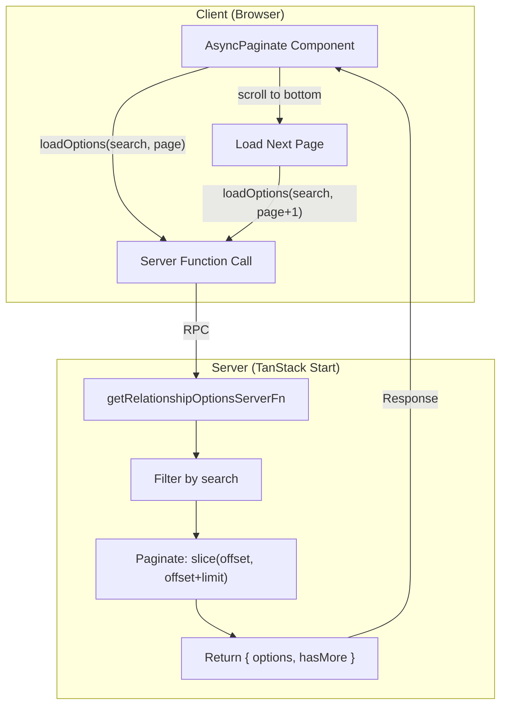

## 1. Main Goal

1. **Server-side pagination** — Create a TanStack Start server function that returns options in paginated chunks, with search/filter support
2. **Async search** — Typing in the select triggers server-side queries via `AsyncPaginate`'s `loadOptions`

## 2. Architecture Overview



---

### Dependency

Install `react-select-async-paginate`:

```bash
pnpm add react-select-async-paginate
```
